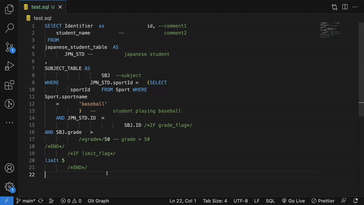

# uroboroSQL-fmt for VSCode




A Visual Studio Code extension for [uroboroSQL-fmt](https://github.com/future-architect/uroborosql-fmt) that is a tool that formats SQL statements according to [SQL coding standards created by Future Corporation](https://future-architect.github.io/coding-standards/documents/forSQL/SQL%E3%82%B3%E3%83%BC%E3%83%87%E3%82%A3%E3%83%B3%E3%82%B0%E8%A6%8F%E7%B4%84%EF%BC%88PostgreSQL%EF%BC%89.html) (Japanese only).

## Usage

Once installed in Visual Studio Code, "uroborosql-fmt" will be available as a formatter for SQL files. Please select "uroborosql-fmt" (extension id:`Future.uroborosql-fmt`) as the default formatter. You can do this either by using the context menu (right click on a open SQL file in the editor) and select "Format Document With...", or you can add the following to your settings:

```json
{
  "[sql]": {
    "editor.defaultFormatter": "Future.uroborosql-fmt"
  }
}
```

### Format on save

You can enable format on save for SQL by having the following values in your settings:

```json
{
  "[sql]": {
    "editor.defaultFormatter": "Future.uroborosql-fmt",
    "editor.formatOnSave": true
  }
}
```

## Settings

| Settings                             | Defaults | Description                                                                                                                                                                                                                                                                                               |
| ------------------------------------ | -------- | --------------------------------------------------------------------------------------------------------------------------------------------------------------------------------------------------------------------------------------------------------------------------------------------------------- |
| uroborosql-fmt.configurationFilePath | null     | The path of configuration file. File extension must be `.json`. If you don't specify the path and `./.uroborosqlfmtrc.json` exists, formatter will use `./.uroborosqlfmtrc.json`. If you doesn't specify and `.uroborosqlfmtrc.json` doesn't exist, formatter will use formatters default configurations. |

### Configuration options

```json
{
  "debug": false,
  "tab_size": 4,
  "complement_alias": true,
  "trim_bind_param": false,
  "keyword_case": "preserve",
  "identifier_case": "preserve",
  "max_char_per_line": 50,
  "complement_outer_keyword": true,
  "complement_column_as_keyword": true,
  "remove_table_as_keyword": true,
  "remove_redundant_nest": true,
  "complement_sql_id": true,
  "convert_double_colon_cast": false,
  "unify_not_equal": true
}
```

Create `.uroborosqlfmtrc.json` in the directory where you run the command and write the configuration there.

If there is no configuration file, the default values are used.

| name                                                                                                                                        | type                                 | description                                                                                                                                                                                                                                            | default |
| ------------------------------------------------------------------------------------------------------------------------------------------- | ------------------------------------ | ------------------------------------------------------------------------------------------------------------------------------------------------------------------------------------------------------------------------------------------------------ | ------- |
| [`debug`](https://github.com/future-architect/uroborosql-fmt/blob/main/docs/options/debug.md)                                               | bool                                 | Run in debug mode.                                                                                                                                                                                                                                     | false   |
| [`tab_size`](https://github.com/future-architect/uroborosql-fmt/blob/main/docs/options/tab_size.md)                                         | int                                  | Tab size used for formatting.                                                                                                                                                                                                                          | 4       |
| [`complement_alias`](https://github.com/future-architect/uroborosql-fmt/blob/main/docs/options/complement_alias.md)                         | bool                                 | Complement aliases. Currently, column names are auto-completed with the same name. (e.g. `COL1` → `COL1 AS COL1`)                                                                                                                                      | true    |
| [`trim_bind_param`](https://github.com/future-architect/uroborosql-fmt/blob/main/docs/options/trim_bind_param.md)                           | bool                                 | Trim the contents of the [bind parameters](https://future-architect.github.io/uroborosql-doc/background/#%E3%83%8F%E3%82%99%E3%82%A4%E3%83%B3%E3%83%88%E3%82%99%E3%83%8F%E3%82%9A%E3%83%A9%E3%83%A1%E3%83%BC%E3%82%BF). (e.g. `/* foo */` → `/*foo*/`) | false   |
| [`keyword_case`](https://github.com/future-architect/uroborosql-fmt/blob/main/docs/options/keyword_case.md)                                 | [`"upper"`, `"lower"`, `"preserve"`] | Unify the case of keywords. (No conversion in case of `"preserve"`)                                                                                                                                                                                    | lower   |
| [`identifier_case`](https://github.com/future-architect/uroborosql-fmt/blob/main/docs/options/identifier_case.md)                           | [`"upper"`, `"lower"`, `"preserve"`] | Unify the case of identifiers. (No conversion in case of `"preserve"`)                                                                                                                                                                                 | lower   |
| [`max_char_per_line`](https://github.com/future-architect/uroborosql-fmt/blob/main/docs/options/max_char_per_line.md)                       | int                                  | If the total number of characters in the function name and arguments exceeds `max_char_per_line`, the arguments are formatted with new lines.                                                                                                          | 50      |
| [`complement_outer_keyword`](https://github.com/future-architect/uroborosql-fmt/blob/main/docs/options/complement_outer_keyword.md)         | bool                                 | Complement the optional `OUTER`. (e.g. `LEFT JOIN` → `LEFT OUTER JOIN`)                                                                                                                                                                                | true    |
| [`complement_column_as_keyword`](https://github.com/future-architect/uroborosql-fmt/blob/main/docs/options/complement_column_as_keyword.md) | bool                                 | Complement `AS` in column aliases.                                                                                                                                                                                                                     | true    |
| [`remove_table_as_keyword`](https://github.com/future-architect/uroborosql-fmt/blob/main/docs/options/remove_table_as_keyword.md)           | bool                                 | Remove `AS` in table aliases.                                                                                                                                                                                                                          | true    |
| [`remove_redundant_nest`](https://github.com/future-architect/uroborosql-fmt/blob/main/docs/options/remove_redundant_nest.md)               | bool                                 | Remove redundant parentheses. (e.g. `(((foo)))` → `(foo)`)                                                                                                                                                                                             | true    |
| [`complement_sql_id`](https://github.com/future-architect/uroborosql-fmt/blob/main/docs/options/complement_sql_id.md)                       | bool                                 | Complement [SQL ID](https://palette-doc.rtfa.as/coding-standards/forSQL/SQL%E3%82%B3%E3%83%BC%E3%83%87%E3%82%A3%E3%83%B3%E3%82%B0%E8%A6%8F%E7%B4%84%EF%BC%88uroboroSQL%EF%BC%89.html#sql-%E8%AD%98%E5%88%A5%E5%AD%90).                                 | false   |
| [`convert_double_colon_cast`](https://github.com/future-architect/uroborosql-fmt/blob/main/docs/options/convert_double_colon_cast.md)       | bool                                 | Convert casts by `X::type` to the form `CAST(X AS type)`.                                                                                                                                                                                              | true    |
| [`unify_not_equal`](https://github.com/future-architect/uroborosql-fmt/blob/main/docs/options/unify_not_equal.md)                           | bool                                 | Convert comparison operator `<>` to `!=`                                                                                                                                                                                                               | true    |

## Available Commands

| command title                                                | description                                                                                                                                                                                                                                                                                                                                      |
| ------------------------------------------------------------ | ------------------------------------------------------------------------------------------------------------------------------------------------------------------------------------------------------------------------------------------------------------------------------------------------------------------------------------------------ |
| Format SQL                                                   | You can trigger formatting by executing this command.                                                                                                                                                                                                                                                                                            |
| Export workspace config to uroborosql-fmt config file        | You can export workspace configurations to formatter's configuration file (specified in [uroborosql-fmt.ConfigurationFilePath](https://github.com/future-architect/vscode-uroborosql-fmt/#:~:text=uroborosql%2Dfmt.configurationFilePath)). Only the non-null configurations in `settings.json` will overwrite those in `.uroborosqlfmtrc.json`. |
| Import uroborosql-fmt config file config to workspace config | You can import formatter's configuration into workspace configuration. Configuration values that exist in `settings.json`, but not in `.uroborosqlfmtrc.json`, will be set to `null`.                                                                                                                                                            |
| Import uroborosql-fmt config file config to global config    | You can import formatter's configuration into global configuration. Configuration values that exist in `settings.json`, but not in `.uroborosqlfmtrc.json`, will be set to `null`.                                                                                                                                                               |

## License

[Business Source License 1.1](https://github.com/future-architect/vscode-uroborosql-fmt/blob/main/LICENSE)
